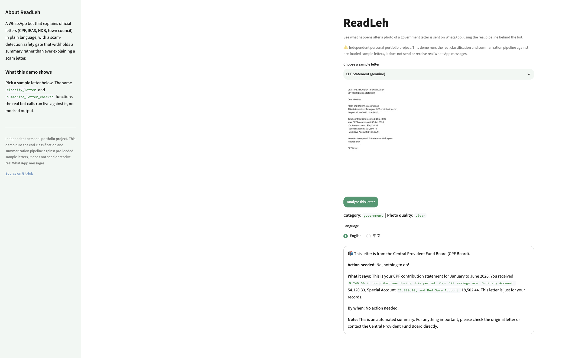

# Government Letter Summarizer & Scam Detector

**readformeleh** — A WhatsApp-native bot that summarizes official government letters (CPF,
IRAS, HDB, town council) into plain-language English, Mandarin, Malay, or
Tamil, for Singaporean seniors and their caregivers. Includes a
scam-detection safety layer that withholds a summary and refers to
ScamShield instead of summarizing suspicious mail (with a scam-type
classification - phishing, prize, impersonation, romance, investment -
for the reader's own awareness), hardened against prompt-injection
attempts embedded in the letter photo itself, and a self-consistency
check that re-reads a letter's key figures independently before trusting
them. A companion to
[checkformeleh](https://github.com/fangting89/checkformeleh) and
[isitrealah](https://github.com/fangting89/isitrealah).

**Live demo:** [readformeleh.streamlit.app](https://readformeleh.streamlit.app)
(runs the real pipeline against pre-loaded sample letters, doesn't send or
receive real WhatsApp messages, see [Demo](#demo) below)
**Interactive walkthrough** (how the pipeline works, no live API calls needed to view): [fangting89.github.io/readformeleh/walkthrough.html](https://fangting89.github.io/readformeleh/walkthrough.html)



See [docs/DESIGN.md](docs/DESIGN.md) for the problem statement, evidence
base, architecture, and design decisions.

## Why this matters

Seniors aged 65+ made up almost 15% of Singapore scam victims in 2025,
nearly double the 8.4% share in 2024, with the highest average loss of
any age group (S$37,053) - and their top vectors were investment scams
and, notably, **government-official impersonation**, exactly the mail
this bot screens
([source](https://theonlinecitizen.com/2026/05/07/seniors-aged-65-and-above-made-up-15-of-scam-victims-in-2025-losing-s-37-000-on-average),
[source](https://www.thestar.com.my/aseanplus/aseanplus-news/2026/02/25/singapore-scam-losses-fall-to-s913mil-in-2025-new-trend-of-victims-handing-over-gold-bars-to-syndicates)).
Two of this project's real-world-validation eval specimens
(`scam_real_police_warrant`, `scam_real_pdpc`) are reconstructed directly
from published SPF/PDPC advisories describing this exact pattern.

## Relevance to HTX

The forced tool-use gate (`classify_letter`, `temperature=0`, tool choice
never `"auto"`) and the deterministic, no-LLM-judge eval harness are the
same engineering discipline HTX's own AI programme names explicitly:
"AI Central" governance/assurance, and "AI safety and security" as a
stated AI R&D focus area. The adversarial prompt-injection specimen
(`scam_prompt_injection`) and the two real-advisory specimens above are
the concrete evidence behind that claim, not just an assertion.

This project sits on the citizen-facing, preventive side of a problem
HTX's own institutional tools (e.g. Digital & Information Forensics'
DIGEST, Q Team's Online Casino Hunter) address from the investigator
side - helping someone before they're a victim, rather than triaging
evidence after the fact.

## Vision: one senior-protection toolkit, not three disconnected tools

readformeleh (comprehension of official mail), checkformeleh (access to
support schemes), and isitrealah (authenticity of AI-generated/scam
content) each address a different, evidenced layer of how Singapore's
seniors are vulnerable:

| Need | Status | Evidence |
|---|---|---|
| Comprehension (official mail) | Built - readformeleh | Government-impersonation is seniors' top scam vector |
| Access (support schemes) | Built - [checkformeleh](https://github.com/fangting89/checkformeleh) | Schemes scattered across fragmented gov sites |
| Authenticity (AI content, scams) | Built - [isitrealah](https://github.com/fangting89/isitrealah) | 15% of scam victims now 65+, nearly doubled in a year |
| Social connection (loneliness) | Named next module | 1 in 3 seniors feel lonely most of the time; isolation is linked to 3-5 fewer years of life at 60 ([MOH](https://www.moh.gov.sg/newsroom/addressing-loneliness-and-psychological-distress-among-seniors-living-alone/), [source](https://www.alamiclinic.com/blog/how-loneliness-impacts-elderly-health-in-singapore-and-what-we-can-do)) |

The social-connection module (a befriender/activity-finder) would reuse
checkformeleh's RAG pattern over a different corpus, not a rewrite - which
is possible specifically because the forced tool-use gate mechanics
underneath all three now live in one shared, tested library,
[lehcore](https://github.com/fangting89/lehcore), rather than being
hand-copied per project.

## Sovereignty

This project uses the Anthropic API directly, not an on-prem/air-gapped
model. HTX's own 2026 direction treats sovereign AI (on-prem, air-gapped,
e.g. their NGINE/Phoenix stack) as "non-negotiable" for public safety
data specifically because sensitive citizen data shouldn't leave a
controlled environment. For a personal portfolio project handling only
synthetic specimens (no real letters, no real NRIC/financial data - see
`CLAUDE.md`'s no-content-persistence invariant), a managed API is the
right tradeoff for cost and iteration speed. A real institutional
deployment of this pattern would need to swap the Claude API calls for a
locally-hosted open-weight model behind the same `lehcore.call_structured`
interface - the forced-tool-use/temperature=0 mechanics don't change,
only where the model runs.

## Scalability & Production Path

Owning the real gaps, not just the parts that already work:

- **Already handled**: the public demo is deliberately scoped to
  pre-loaded samples, not arbitrary uploads (cost/abuse control, not an
  oversight - see `demo_app.py`'s docstring), plus a per-session analysis
  cap (`MAX_ANALYSES_PER_SESSION`).
- **Real gap**: Streamlit Community Cloud's free tier is a single
  process, not built for real concurrency. A production version would be
  containerized and deployed the way I already do professionally (AWS
  Lambda for the solar-forecasting pipeline, GCP Cloud Run for the AIAP
  deepskilling capstone), not rebuilt from scratch.
- **Real gap**: `app/state.py`'s per-sender language/rate-limit state is
  in-memory - it doesn't survive a restart and doesn't work correctly
  across more than one running instance. Production fix: move it to a
  shared store (Redis/DynamoDB).
- **Real gap**: no drift/failure monitoring exists yet on this project.
  I've built exactly this before (Evidently drift checks, SNS failure
  alerts on the solar-forecasting pipeline) - the same discipline, not a
  new one, would apply here.

## Setup

```
uv sync
cp .env.example .env  # fill in ANTHROPIC_API_KEY, TWILIO_ACCOUNT_SID, TWILIO_AUTH_TOKEN
uvx pre-commit install
```

## Usage

```
python -m pipeline.run photo.jpg --lang zh   # or ms, ta
```

## Demo

`demo_app.py` is a Streamlit demo (not the production WhatsApp bot) that
runs the real `classify_letter` and `summarize_letter_checked` pipeline
live against the sample letters in `samples/`, no mocked output. Scoped to
those pre-loaded samples only, not arbitrary photo uploads, since each
run costs real Claude vision calls and a public upload form would mean
strangers' documents flowing through a personal API key. Also capped at
`MAX_ANALYSES_PER_SESSION` analyses per session as a second, independent
cost control.

```
uv run streamlit run demo_app.py
```
